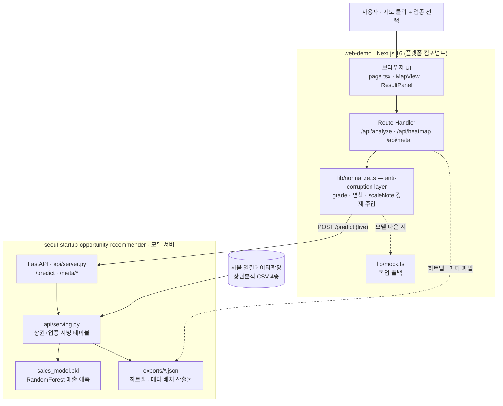
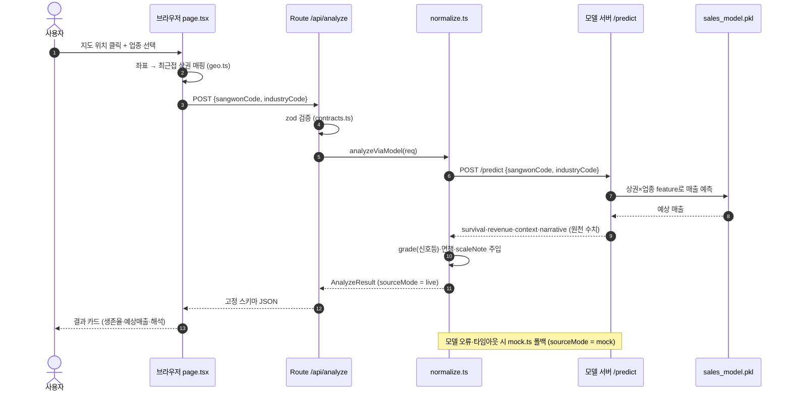

# 상권 인사이트 — 웹 데모 (플랫폼 컴포넌트)

> AI 경진대회 제출용 데모. 기획 문서: [`../files/PRD.md`](../files/PRD.md) ·
> [`../files/TECH_SPEC.md`](../files/TECH_SPEC.md) · [`../files/USE_CASES.md`](../files/USE_CASES.md)
> 모델 서버와의 외부 계약: [`../files/ANSWERS.md`](../files/ANSWERS.md)

"이 자리에 이 업종, 들어가도 될까?" — 지도에서 위치·업종을 고르면
**실측 생존율(신호등) + AI 예상 매출 + 해석**을 하나의 결과 카드로 보여준다.

## 실행

```bash
pnpm install
pnpm dev        # http://localhost:3000
```

같이 띄우면 좋은 것 (없어도 목업 폴백으로 데모는 동작):

```bash
# 모델 서버 (별도 터미널, seoul-startup-opportunity-recommender 레포에서)
.venv/Scripts/uvicorn api.server:app --port 8000
```

### 환경변수 (`.env.local`, 예시는 `.env.example`)

| 변수 | 설명 |
|---|---|
| `MODEL_SERVER_URL` | FastAPI 모델 서버 (기본 `http://localhost:8000`) |
| `MODEL_EXPORTS_DIR` | 히트맵/메타 배치 산출물 폴더 (기본: `../seoul-startup-opportunity-recommender/exports`) |
| `NEXT_PUBLIC_KAKAO_MAP_KEY` | 카카오맵 JS 키 — **없으면 상권 검색 리스트 폴백 UI로 동작** |
| `MOCK_FALLBACK` | `false`면 모델 오류 시 목업 대신 502 (기본: 목업 폴백 on) |

## 아키텍처 (TECH_SPEC §2)

두 저장소가 이렇게 맞물린다 (브라우저는 모델 서버를 직접 호출하지 않고 항상 `/api/*` 경유):



**분석 요청 한 번의 여정** — 위치·업종을 넘기면 실측 데이터가 돌아온다:



- **내부 계약**: `lib/contracts.ts` (zod). grade(신호등) 판정·면책(disclaimer)·집계수준(scaleNote)은
  route handler가 **강제 주입** — UI가 누락할 수 없다.
- **외부 계약 흡수**: `lib/normalize.ts` 한 곳만 고치면 모델 스펙 변경에 대응.
- **목업 폴백**: 모델 서버 다운 시 `lib/mock.ts` 반환 + `sourceMode: "mock"` 배지 노출 (UC-006).
- **히트맵**: 실시간 추론 없이 배치 산출 JSON을 읽는다 (UC-002). 생존율이 현재 업종 단위
  통계라 기본 색 기준은 **매출 백분위** (토글로 생존율 전환 가능).

## 데모 시나리오

1. **자리부터 찾기(UC-001)**: 지도 클릭 → "선택한 곳: ○○상권" → 업종 선택 → 분석하기
2. **업종부터 찾기(UC-002)**: 업종 선택 → 히트맵 → 상권 클릭 → 동일 결과 카드
3. **재탐색(UC-003)**: 결과 카드의 "다른 업종/다른 위치" — 첫 분석 후엔 조건 변경 시 자동 재질의
4. **데이터 부족(UC-004)**: 표본 0건 조합 → 숫자 대신 표본 근거 안내 (예: 영천시장입구 × PC방)
5. **모델 다운(UC-006)**: 모델 서버 꺼도 목업 배지와 함께 데모 지속

## 주의 (심사 대비 정직성 포인트)

- 생존율은 **예측이 아닌 실측 폐업률의 3년 환산**이며, 현재 업종 단위 통계(상권별 동일) — UI에 명시됨
- 예상 매출은 **상권×업종 전체 점포 합산** 규모(1개 점포 매출 아님) — scaleNote로 강제 표기
- 모든 결과 카드에 신뢰도·표본 수·기준 시점·출처가 붙는다
