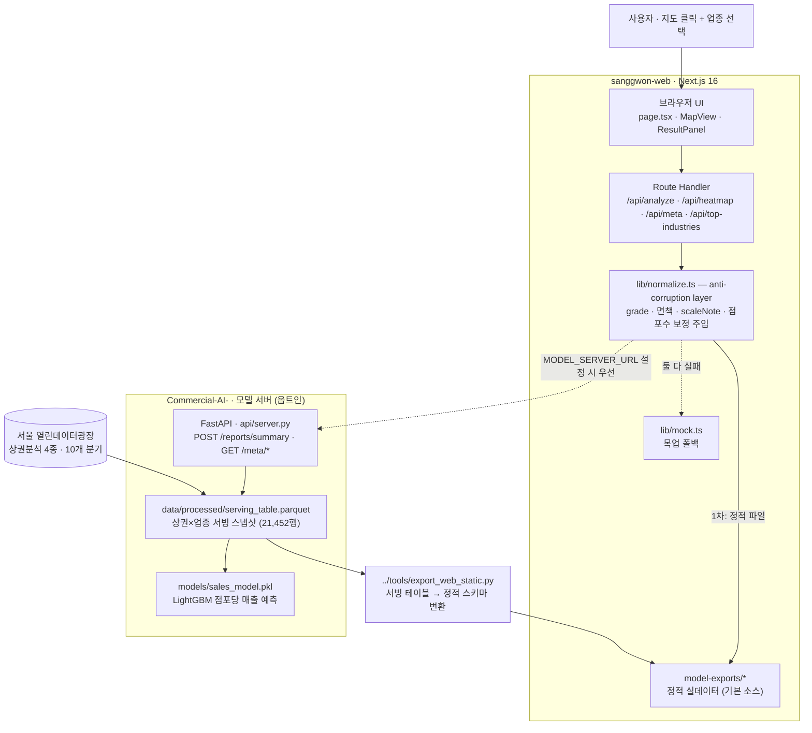
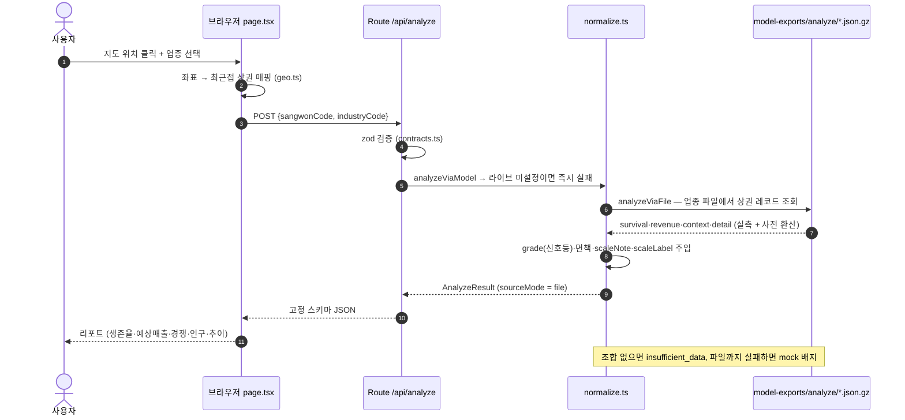

# 상권 인사이트 — 웹 데모 (플랫폼 컴포넌트)

> AI 경진대회 제출용 데모. 기획 문서: [`../files/PRD.md`](../files/PRD.md) ·
> [`../files/TECH_SPEC.md`](../files/TECH_SPEC.md) · [`../files/USE_CASES.md`](../files/USE_CASES.md) ·
> 데이터 정본 [`../files/DATA_REQUIREMENTS.md`](../files/DATA_REQUIREMENTS.md)

"이 자리에 이 업종, 들어가도 될까?" — 지도에서 위치·업종을 고르면
**실측 생존율(신호등) + AI 예상 매출 + 해석**을 하나의 리포트로 보여준다.

## 실행

```bash
pnpm install
pnpm dev        # http://localhost:3000
```

**모델 서버 없이도 실데이터로 동작한다.** `model-exports/` 에 담긴 정적 산출물
(62업종 × 1,570상권, `../tools/export_web_static.py` 산출)이 기본 소스다.

라이브 모델 서버를 붙이려면 `.env.local` 의 `MODEL_SERVER_URL` 주석을 해제하고:

```bash
# 별도 터미널 — Commercial-AI- 레포
../Commercial-AI-/.venv/Scripts/python.exe -m uvicorn api.server:app --port 8000 --app-dir ../Commercial-AI-
```

> 라이브는 단일 분기 관측만 쓸 수 있어 생존율이 정적 산출물(10분기 누적 축소추정)보다 거칠고,
> 서빙 테이블이 스냅샷이라 추이·요일별 차트가 없다. **시연 기본은 정적을 권한다.**

### 환경변수 (`.env.local`, 예시는 `.env.example`)

| 변수 | 설명 |
|---|---|
| `MODEL_SERVER_URL` | 라이브 모델 서버 — **옵트인**. 미설정이면 라이브 호출을 아예 시도하지 않는다 |
| `MODEL_EXPORTS_DIR` | 정적 산출물 폴더 (기본: `<프로젝트 루트>/model-exports`) |
| `NEXT_PUBLIC_KAKAO_MAP_KEY` | 카카오맵 JS 키 — **없으면 상권 검색 리스트 폴백 UI로 동작** |
| `MOCK_FALLBACK` | `false`면 오류 시 목업 대신 502 (기본: 목업 폴백 on) |

⚠️ `MODEL_EXPORTS_DIR` 를 `../Commercial-AI-/exports` 로 가리키지 말 것 — 스키마가 달라
(`cells`↔`items`, `sangwonCode`↔`districtCode`) 조용히 빈 히트맵이 된다.
⚠️ `NEXT_PUBLIC_*` 는 **빌드 시점에 인라인**된다. Vercel 은 `.env.local` 을 받지 않으므로
프로젝트 환경변수에 직접 등록해야 지도가 뜬다.

## 아키텍처

브라우저는 모델 서버를 직접 호출하지 않고 항상 `/api/*` 를 경유한다.


```mermaid
flowchart TB
    User["사용자 · 지도 클릭 + 업종 선택"]

    subgraph WEB["sanggwon-web · Next.js 16"]
        direction TB
        UI["브라우저 UI<br/>page.tsx · MapView · ResultPanel"]
        RT["Route Handler<br/>/api/analyze · /api/heatmap · /api/meta · /api/top-industries"]
        NORM["lib/normalize.ts — anti-corruption layer<br/>grade · 면책 · scaleNote · 점포수 보정 주입"]
        EXP["model-exports/*<br/>정적 실데이터 (기본 소스)"]
        MOCK["lib/mock.ts<br/>목업 폴백"]
    end

    subgraph MODEL["Commercial-AI- · 모델 서버 (옵트인)"]
        direction TB
        SRV["FastAPI · api/server.py<br/>POST /reports/summary · GET /meta/*"]
        SERV["data/processed/serving_table.parquet<br/>상권×업종 서빙 스냅샷 (21,452행)"]
        PKL["models/sales_model.pkl<br/>LightGBM 점포당 매출 예측"]
    end

    TOOL["../tools/export_web_static.py<br/>서빙 테이블 → 정적 스키마 변환"]
    CSV[("서울 열린데이터광장<br/>상권분석 4종 · 10개 분기")]

    User --> UI --> RT --> NORM
    NORM -->|"1차: 정적 파일"| EXP
    NORM -.->|"MODEL_SERVER_URL 설정 시 우선"| SRV
    NORM -.->|"둘 다 실패"| MOCK
    SRV --> SERV --> PKL
    CSV --> SERV
    SERV --> TOOL --> EXP
```

**분석 요청 한 번의 여정** (기본 = 정적 경로):


```mermaid
sequenceDiagram
    autonumber
    actor U as 사용자
    participant B as 브라우저 page.tsx
    participant R as Route /api/analyze
    participant N as normalize.ts
    participant F as model-exports/analyze/*.json.gz

    U->>B: 지도 위치 클릭 + 업종 선택
    B->>B: 좌표 → 최근접 상권 매핑 (geo.ts)
    B->>R: POST {sangwonCode, industryCode}
    R->>R: zod 검증 (contracts.ts)
    R->>N: analyzeViaModel → 라이브 미설정이면 즉시 실패
    N->>F: analyzeViaFile — 업종 파일에서 상권 레코드 조회
    F-->>N: survival·revenue·context·detail (실측 + 사전 환산)
    N->>N: grade(신호등)·면책·scaleNote·scaleLabel 주입
    N-->>R: AnalyzeResult (sourceMode = file)
    R-->>B: 고정 스키마 JSON
    B-->>U: 리포트 (생존율·예상매출·경쟁·인구·추이)
    Note over N,F: 조합 없으면 insufficient_data, 파일까지 실패하면 mock 배지
```

- **내부 계약**: `lib/contracts.ts` (zod). grade·면책(`disclaimer`)·집계수준(`scaleNote`/
  `scaleLabel`)·보정 안내(`competition.correction`)는 route handler 가 **강제 주입** —
  UI 가 누락하거나 하드코딩할 수 없다
- **외부 계약이 2개**: 라이브(`normalizeSummary`)와 정적(`normalizeAnalyze`)의 스키마가
  호환되지 않는다. `lib/normalize.ts` 상단 주석 참조 — **매퍼를 섞지 말 것**
- **목업 폴백**: 둘 다 실패 시 `lib/mock.ts` + `sourceMode: "mock"` 배지 (UC-006)
- **히트맵**: 실시간 추론 없이 정적 JSON 을 읽는다 (UC-002). 기본 색은 **매출 백분위**,
  토글로 생존율 전환 (생존율도 이제 상권별 변별력이 있다)

## 데모 시나리오

1. **자리부터 찾기(UC-001)**: 지도 클릭 → "선택한 곳" → 업종별 기회 순위 → 업종 선택 → 리포트
2. **업종부터 찾기(UC-002)**: 업종 선택 → 히트맵 → 상권 클릭 → 동일 리포트
3. **재탐색(UC-003)**: "다른 업종/다른 위치" — 첫 분석 후엔 조건 변경 시 자동 재질의
4. **데이터 부족(UC-004)**: 표본 없는 조합 → 숫자 대신 표본 근거 안내
5. **순위 데이터 없는 상권**: 사유를 밝히고 업종 직접 선택 경로를 연다 (막힘 없음)
6. **모델 다운(UC-006)**: 정적 폴백으로 지속, 그마저 실패하면 목업 배지

## 주의 (심사 대비 정직성 포인트)

- 생존율은 **예측이 아닌 실측 폐업률의 3년 환산**. 표본이 적은 상권은 업종 평균으로
  **축소추정 보정**했고 그 사실을 UI 에 명시한다 (보정 없이는 76.8% 가 100% 로 표시됨)
- 예상 매출은 **점포당 예측값**(상권 합산 아님). 학습 타깃 분모가 프랜차이즈를 제외한
  점포 수라 **프랜차이즈 비중이 큰 업종에서 과대 추정**이며, 이 한계도 리포트에 적어둔다
- 점포 수·프랜차이즈 비율은 **보정된 값**이며 `보정됨` 배지와 근거를 노출한다
- 치안(⑥)·배후지(⑦)는 실데이터 미보유 구간으로 **예시 데이터**임을 배너로 표시한다
- 모든 리포트에 신뢰도·표본 수·기준 시점·출처가 붙는다
