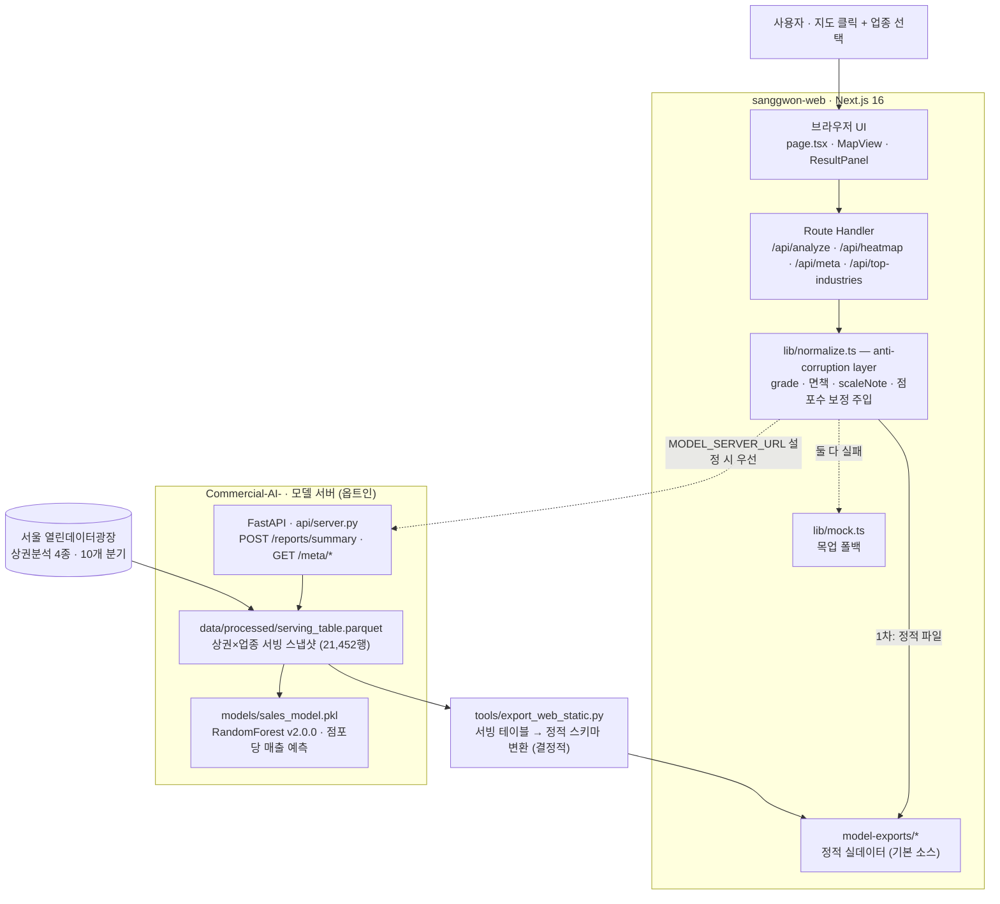
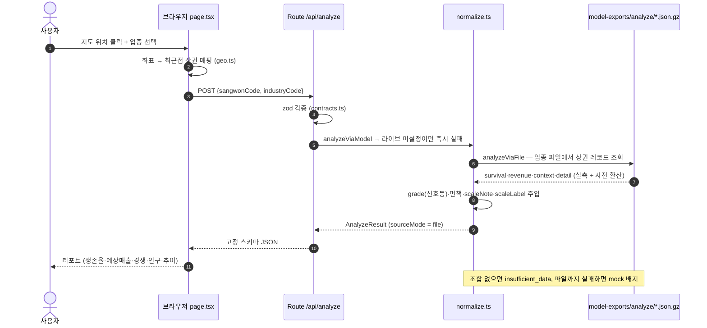
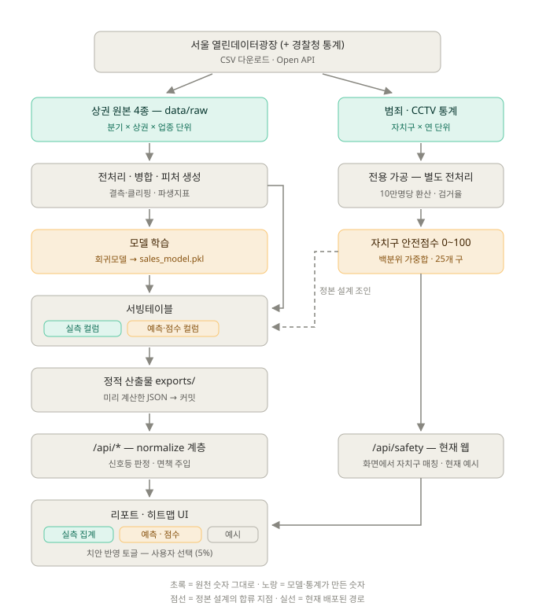

# 상권 인사이트 — 웹 데모 (플랫폼 컴포넌트)

> AI 경진대회 제출용 데모. 기획 문서: [`../files/PRD.md`](../files/PRD.md) ·
> [`../files/TECH_SPEC.md`](../files/TECH_SPEC.md) · [`../files/USE_CASES.md`](../files/USE_CASES.md) ·
> 데이터 정본 [`../files/DATA_REQUIREMENTS.md`](../files/DATA_REQUIREMENTS.md)

"이 자리에 이 업종, 들어가도 될까?" — 지도에서 위치·업종을 고르면
**실측 생존율(신호등) + AI 예상 매출 + 해석**을 하나의 리포트로 보여준다.

## 실행

```bash
pnpm install
pnpm dev        # http://localhost:3000
```

**모델 서버 없이도 실데이터로 동작한다.** `model-exports/` 에 담긴 정적 산출물
(62업종 × 1,570상권, [`tools/export_web_static.py`](tools/export_web_static.py) 산출)이 기본 소스다.

> 📚 **문서가 12개다. 뭘 읽을지는 [docs/README.md](docs/README.md) 에서 목적별로 고르라** —
> 낡아서 읽으면 안 되는 문서까지 구분해 뒀다.
> 급하면 [docs/OPEN-ITEMS.md](docs/OPEN-ITEMS.md) **헤더 요약표**(현재 남은 일)와
> [docs/DATA-CATALOG.md](docs/DATA-CATALOG.md)(화면 ↔ 데이터 매핑) 둘이면 된다.

라이브 모델 서버를 붙이려면 `.env.local` 의 `MODEL_SERVER_URL` 주석을 해제하고:

```bash
# 별도 터미널 — Commercial-AI- 레포
../Commercial-AI-/.venv/Scripts/python.exe -m uvicorn api.server:app --port 8000 --app-dir ../Commercial-AI-
```

> 라이브는 단일 분기 관측만 쓸 수 있어 생존율이 정적 산출물(10분기 누적 축소추정)보다 거칠고,
> 서빙 테이블이 스냅샷이라 추이·요일별 차트가 없다. **시연 기본은 정적을 권한다.**

### 환경변수 (`.env.local`, 예시는 `.env.example`)

| 변수 | 설명 |
|---|---|
| `MODEL_SERVER_URL` | 라이브 모델 서버 — **옵트인**. 미설정이면 라이브 호출을 아예 시도하지 않는다 |
| `MODEL_EXPORTS_DIR` | 정적 산출물 폴더 (기본: `<프로젝트 루트>/model-exports`) |
| `NEXT_PUBLIC_KAKAO_MAP_KEY` | 카카오맵 JS 키 — **없으면 상권 검색 리스트 폴백 UI로 동작** |
| `MOCK_FALLBACK` | `false`면 오류 시 목업 대신 502 (기본: 목업 폴백 on) |

⚠️ `MODEL_EXPORTS_DIR` 를 `../Commercial-AI-/exports` 로 가리키지 말 것 — 스키마가 달라
(`cells`↔`items`, `sangwonCode`↔`districtCode`) 조용히 빈 히트맵이 된다.
⚠️ `NEXT_PUBLIC_*` 는 **빌드 시점에 인라인**된다. Vercel 은 `.env.local` 을 받지 않으므로
프로젝트 환경변수에 직접 등록해야 지도가 뜬다.

### 데이터 재생성 (`model-exports/`)

`model-exports/` 는 커밋되어 배포에 함께 올라간다. 원본에서 다시 만들려면 모델 저장소
(`Commercial-AI-`, 형제 디렉터리)와 그 `.venv` 가 필요하다.

```bash
# academy 루트에서. 스크립트는 cwd 와 무관하게 __file__ 기준으로 경로를 잡는다
Commercial-AI-/.venv/Scripts/python.exe Commercial-AI-/scripts/build_features.py
Commercial-AI-/.venv/Scripts/python.exe sanggwon-web/tools/prepare_feature_table.py
Commercial-AI-/.venv/Scripts/python.exe Commercial-AI-/scripts/build_serving_table.py
Commercial-AI-/.venv/Scripts/python.exe sanggwon-web/tools/export_web_static.py
```

| 스크립트 | 역할 |
|---|---|
| [`tools/export_web_static.py`](tools/export_web_static.py) | 서빙 테이블 + 원본 CSV → 정적 스키마. 생존율 축소추정·점포수 보정·요일/시간대/성별/연령 분해·5분기 추이를 여기서 구운다 |
| [`tools/prepare_feature_table.py`](tools/prepare_feature_table.py) | 외부(부동산·치안) 데이터 없이 돌릴 때 학습본이 요구하는 컬럼 6개를 NaN 으로 보정. 없으면 서빙 테이블 생성이 `KeyError` 로 실패한다 |
| [`tools/build_safety_scores.py`](tools/build_safety_scores.py) | 범죄·인구·CCTV(xlsx) → `meta/safety-scores.json` — 자치구 안전점수 + ⑥ 타일 |
| [`tools/build_hinterland.py`](tools/build_hinterland.py) | 상주인구·직장인구·아파트·집객시설·소득소비 → `meta/hinterland.json.gz` — ⑦ 배후지 |

**출력은 결정적이다** (gzip 헤더 mtime 고정). 재실행 후 `git diff` 가 비어 있으면 데이터가
그대로라는 뜻이고, 비어 있지 않으면 **실제로 값이 바뀐 것**이다.

> 이 스크립트들이 모델 저장소가 아니라 이 레포에 있는 이유는
> [docs/OPEN-ITEMS.md](docs/OPEN-ITEMS.md) §7 참조 (루트 저장소에 원격이 없어 재현성 확보 불가).

## 아키텍처

브라우저는 모델 서버를 직접 호출하지 않고 항상 `/api/*` 를 경유한다.


```mermaid
flowchart TB
    User["사용자 · 지도 클릭 + 업종 선택"]

    subgraph WEB["sanggwon-web · Next.js 16"]
        direction TB
        UI["브라우저 UI<br/>page.tsx · MapView · ResultPanel"]
        RT["Route Handler<br/>/api/analyze · /api/heatmap · /api/meta · /api/top-industries"]
        NORM["lib/normalize.ts — anti-corruption layer<br/>grade · 면책 · scaleNote · 점포수 보정 주입"]
        EXP["model-exports/*<br/>정적 실데이터 (기본 소스)"]
        MOCK["lib/mock.ts<br/>목업 폴백"]
    end

    subgraph MODEL["Commercial-AI- · 모델 서버 (옵트인)"]
        direction TB
        SRV["FastAPI · api/server.py<br/>POST /reports/summary · GET /meta/*"]
        SERV["data/processed/serving_table.parquet<br/>상권×업종 서빙 스냅샷 (21,452행)"]
        PKL["models/sales_model.pkl<br/>RandomForest v2.0.0 · 점포당 매출 예측"]
    end

    TOOL["tools/export_web_static.py<br/>서빙 테이블 → 정적 스키마 변환 (결정적)"]
    CSV[("서울 열린데이터광장<br/>상권분석 4종 · 10개 분기")]

    User --> UI --> RT --> NORM
    NORM -->|"1차: 정적 파일"| EXP
    NORM -.->|"MODEL_SERVER_URL 설정 시 우선"| SRV
    NORM -.->|"둘 다 실패"| MOCK
    SRV --> SERV --> PKL
    CSV --> SERV
    SERV --> TOOL --> EXP
```

**분석 요청 한 번의 여정** (기본 = 정적 경로):


```mermaid
sequenceDiagram
    autonumber
    actor U as 사용자
    participant B as 브라우저 page.tsx
    participant R as Route /api/analyze
    participant N as normalize.ts
    participant F as model-exports/analyze/*.json.gz

    U->>B: 지도 위치 클릭 + 업종 선택
    B->>B: 좌표 → 최근접 상권 매핑 (geo.ts)
    B->>R: POST {sangwonCode, industryCode}
    R->>R: zod 검증 (contracts.ts)
    R->>N: analyzeViaModel → 라이브 미설정이면 즉시 실패
    N->>F: analyzeViaFile — 업종 파일에서 상권 레코드 조회
    F-->>N: survival·revenue·context·detail (실측 + 사전 환산)
    N->>N: grade(신호등)·면책·scaleNote·scaleLabel 주입
    N-->>R: AnalyzeResult (sourceMode = file)
    R-->>B: 고정 스키마 JSON
    B-->>U: 리포트 (생존율·예상매출·경쟁·인구·추이)
    Note over N,F: 조합 없으면 insufficient_data, 파일까지 실패하면 mock 배지
```

- **내부 계약**: `lib/contracts.ts` (zod). grade·면책(`disclaimer`)·집계수준(`scaleNote`/
  `scaleLabel`)·보정 안내(`competition.correction`)는 route handler 가 **강제 주입** —
  UI 가 누락하거나 하드코딩할 수 없다
- **외부 계약이 2개**: 라이브(`normalizeSummary`)와 정적(`normalizeAnalyze`)의 스키마가
  호환되지 않는다. `lib/normalize.ts` 상단 주석 참조 — **매퍼를 섞지 말 것**
- **목업 폴백**: 둘 다 실패 시 `lib/mock.ts` + `sourceMode: "mock"` 배지 (UC-006)
- **히트맵**: 실시간 추론 없이 정적 JSON 을 읽는다 (UC-002). 기본 색은 **매출 백분위**,
  토글로 생존율·종합점수 전환 (생존율도 이제 상권별 변별력이 있다)

## 리포트가 제공하는 정보 (9개 섹션)

위치·업종을 고르면 아래 내용이 **하나의 리포트**로 나온다. 모든 숫자에는 출처 라벨
(`실측 집계` / `모델 예측` / 기준 분기 칩)이 붙는다.

| # | 섹션 | 제공 정보 | 근거 |
|---|---|---|---|
| ① | **종합 의견** | 신호등 판정(양호/주의/위험) + 지표별 불릿(생존·매출·기회·경쟁·인구) + 규칙 기반 해석 문장 | 아래 항목들의 요약 |
| ② | **생존 전망** | 3년 생존율 게이지 · 판정 근거 | 실측 폐업률 3년 환산 + 축소추정 |
| ③ | **매출 분석** | 예상 월매출(점포당) · 동일업종 상권 중 상위 % · 실측 분기 매출 · 요일/시간대/성별/연령별 매출 비중 · 5분기 추이 · 전분기·전년동분기 증감 | `모델 예측` + `실측 집계` 구분 표기 |
| ④ | **업종·경쟁 분석** | 동일 업종 점포 수 · 프랜차이즈/일반 · 개·폐업 수와 율 · 점포 수 추이 · **상권/자치구/서울 3단 비교** | 실측 (점포 수는 보정값, 근거 노출) |
| ⑤ | **인구 분석** | 분기 유동인구 · 8분기 추이 · 요일/시간대/성별 분포 · 연령 구성 | 실측 (상권 단위) |
| ⑥ | **치안 참고** | 자치구 5대 범죄 발생 · 서울 평균 대비 · 발생 적은 순 순위 · 10만명당 · 죄종별 + **치안 반영 시 종합점수·순위 변화** | 경찰청 2024 · CCTV 2025 |
| ⑦ | **배후지 분석** | 주거(상주)인구·연령/성별 구성 · 직장인구 · 아파트 단지/평균 시가 · 집객시설(주요 8종) · 배후지 소비지출 9종 | 상권분석서비스 (항목별 기준 분기 표기) |
| ⑧ | **유의사항·한계** | 생존율의 성질, 매출 집계 수준·과대추정 원인, 보정 사실, 혼합 빈티지 안내 | — |
| ⑨ | **데이터 출처** | 실제로 사용한 데이터셋만 나열 (목업 경로면 붙지 않음) | — |

지도에서는 업종별 **히트맵**(매출 백분위 / 생존율 / 종합점수 + 치안 반영 토글)과,
위치 우선 진입 시 그 상권의 **업종 기회 순위**(창업기회점수 ⇄ 예상매출 정렬)를 제공한다.

> 제공하지 않는 것도 화면에 밝힌다 — 소득 분위·총 가구 수·임대시세는 원본 데이터셋에
> 없어서 ⑦ 하단에 "제공하지 않는 항목"으로 이유와 함께 표시한다 (빈칸을 예시 값으로
> 채우지 않는다).

### 어느 숫자가 ML 예측인가 — AI 인스펙터의 '데이터 계보'

지도 위 인스펙터 콘솔이 분석마다 두 줄을 남긴다.

```
ML   학습된 모델의 예측이 쓰인 곳 1개 — ③ 예상 매출
RES  데이터 계보 — ML 예측 1 · 통계 가공 3 · 실측 집계 6 · 규칙 기반 2
```

클릭하면 블록별로 **분류 · 산출 방식 · 근거 필드**가 펼쳐진다. 예:

| 블록 | 분류 | 산출 | 근거 필드 |
|---|---|---|---|
| ③ 예상 매출 | **ML 예측** | 학습된 회귀모델이 예측한 점포당 매출 | `revenue.scaleLabel` · `sourceMode` |
| ② 생존 전망 | 통계 가공 | 실측 폐업률 3년 환산 + 소표본 축소추정 | `survival.basis="empirical_closure_rate_shrunk"` |
| ③ 매출 분포·추이 | 실측 집계 | 카드 결제 기반 추정 원천값 | `detail.sales.basis="card_estimate"` |
| ① 신호등 판정 | 규칙 기반 | 문턱값 판정(safe≥0.60/caution≥0.45) — 웹이 주입 | `survival.grade` |

분류는 [`lib/provenance.ts`](lib/provenance.ts) 가 **응답에 담긴 필드에서 파생**한다 — 화면에
하드코딩하지 않으므로 모델 쪽 산출 방식이 바뀌면(`basis` 값 변경) 이 표도 따라 바뀐다.
"이 서비스는 CSV 조회 아니냐"에 대한 답을 화면에서 바로 보여주기 위한 장치다.

## 데이터 흐름 — 원천에서 리포트까지



리포트에 보이는 숫자는 세 종류이며, UI 라벨로 구분해 노출한다:

| 종류 | 리포트 라벨 | 예 |
|---|---|---|
| 원천 숫자 그대로 (조회) | `실측 집계` | 분기 매출, 요일·시간대·성별·연령 분포, 유동인구, 점포수, 개·폐업, 추이 |
| 모델·통계가 만든 숫자 | `모델 예측` 등 | 예상 매출(회귀 예측), 생존율(폐업률 3년 환산+축소추정), 백분위·종합·안전점수 |
| 실데이터 미보유 구간 | `예시 데이터` | 배후지(⑦) — 상주인구·소득·임대시세 미연동 |

**범죄·CCTV 는 상권 4종과 같은 전처리를 타지 않는다.** 자치구×연 단위라 상권×업종×분기 표와
병합 키가 달라, 전용 가공(10만명당 발생률·검거 비율·CCTV 밀도)을 거친 뒤 자치구+연도 as-of 로
피처 테이블에 붙는다(`Commercial-AI-/src/features/external.py`).

| | 치안(`sf_*`)이 실제로 쓰이는 곳 | 현재 상태 (v2, 2026-08-04) |
|---|---|---|
| 매출 예측 모델 | **학습 피처에서 제외** — ablation 이 `D_plus_real_estate` 를 채택해 `sf_*` 가 빠졌다 | 값은 **실측으로 채워져 있다**(21,452/21,452). 성능을 개선하지 못해 제외된 것이지 데이터가 없어서가 아니다 |
| 종합진단 `overall_score` (= 기회점수의 원천) | `safety_score` 가중 **5%** (`scoring_weights.yaml`) | **동작 중** — `score_safety_gu` 실측이 채워져 재정규화 없이 반영된다 |
| 웹 종합점수 '치안 반영' 토글 | `/api/safety` (범죄 2024·CCTV 2025 **실측**) 가중 5% | **동작 중** — 사용자 옵트인, 모델 파이프라인과 독립 |

즉 치안은 **매출 예측에는 쓰이지 않고 점수·지표로만 쓰인다.** 이는 결측이 아니라 정책이며
metadata 에 명문화돼 있다 — `feature_selection.note`: "부동산/안전 변수가 예측 성능을 개선하지
않으면 모델에서 제외되며, 이 경우 해당 변수는 Serving 의 점수·지표로만 활용된다".

> ⚠️ v1(~2026-08-03)에는 이 표가 정반대였다 — "학습 피처에 포함(`E_plus_safety`)인데 값이
> NaN" 이었다. 옛 문서·커밋에서 그 서술을 보면 낡은 것이다.
>
> 부동산(`re_*` 3개)은 반대로 v2 에서 **학습 피처에 남았다**. 다만 ablation 학습 구간에
> 관측이 0건이라 사실상 노이즈로 채택된 것이며 중요도 합계도 0.19% 다
> (`Commercial-AI-/README.md` §5 에 기록).

## 데모 시나리오

1. **자리부터 찾기(UC-001)**: 지도 클릭 → "선택한 곳" → 업종별 기회 순위 → 업종 선택 → 리포트
2. **업종부터 찾기(UC-002)**: 업종 선택 → 히트맵 → 상권 클릭 → 동일 리포트
3. **재탐색(UC-003)**: "다른 업종/다른 위치" — 첫 분석 후엔 조건 변경 시 자동 재질의
4. **데이터 부족(UC-004)**: 표본 없는 조합 → 숫자 대신 표본 근거 안내
5. **순위 데이터 없는 상권**: 사유를 밝히고 업종 직접 선택 경로를 연다 (막힘 없음)
6. **모델 다운(UC-006)**: 정적 폴백으로 지속, 그마저 실패하면 목업 배지

## 주의 (심사 대비 정직성 포인트)

- 생존율은 **예측이 아닌 실측 폐업률의 3년 환산**. 표본이 적은 상권은 업종 평균으로
  **축소추정 보정**했고 그 사실을 UI 에 명시한다 (보정 없이는 76.8% 가 100% 로 표시됨)
- 예상 매출은 **점포당 예측값**(상권 합산 아님). 프랜차이즈와 독립 점포를 모두 포함한
  평균이므로 **독립 점포의 실제 매출과는 다를 수 있다** — 이 한계를 리포트에 적어둔다.
  (v1 의 "프랜차이즈 비중이 큰 업종에서 과대 추정" 은 분모 버그였고 v2 에서 해소됐다)
- 점포 수·프랜차이즈 비율은 **상류에서 올바르게 온다**. 역산 보정은 v2 에서 제거했고,
  `보정됨` 배지는 상류 회귀 감지용으로만 남겨 뒀다 (평소에는 뜨지 않는 것이 정상)
- 치안(⑥)은 **자치구 단위 실측**(범죄 2024·CCTV 2025). 값은 채워져 있으나 ablation 에서
  성능 기여가 없어 **매출 예측 모델의 학습 피처에서는 제외**됐고, 종합진단 안전점수(5%)와
  종합점수의 **사용자 옵트인 토글(5%)** 로 쓰인다 — 산식·출처를 화면에 노출한다
- 배후지(⑦)는 **실측**이지만 **항목별 기준 분기가 다르다** — 상주·직장인구·아파트·집객시설은
  2026Q1, 소비지출은 원본이 2023Q4 이후 미공개라 그 시점 값이다. 각 블록에 기준 분기를
  칩으로 표기하고, 소비지출 블록에 그 사실을 적는다 (혼합 빈티지를 숨기지 않는다)
- **없는 항목은 없다고 쓴다** — 소득 분위·총 가구 수·임대시세는 원본에 없어 ⑦ 하단에
  이유와 함께 노출한다. 목업으로 채우지 않는다
- 남은 목업은 치안 폴백(`mockSafety`) 하나이며 실데이터가 있으면 호출되지 않는다
- 모든 리포트에 신뢰도·표본 수·기준 시점·출처가 붙는다
